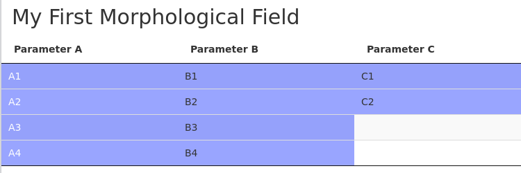

# An R implementation of a Morphological Analysis tool

<!-- [](https://travis-ci.org/rstudio/DT) -->

This package provides an interactive graphical representation of a 
*morphological field*, a.k.a. morphological box, or "Zwicky box", see 
[[1]](#wikipedia1), [[2]](#wikipedia2), [[3]](#wikipedia-de). A morphological 
field is a tabular representation where each parameter of the problem 
corresponds to a column whose rows are filled with the parameter values. Each 
parameter value is mutually checked for consistency with all other parameter 
values. This enables to systematically exclude inconsistent configurations and 
therefore greatly reduce the problem space.

Morphological Analysis (MA)---not to be confused with morphology in linguistics,
biology or image processing---is a structured method for exploring and 
constraining a complex multi-dimensional, possibly non-quantifiable, problem 
space. MA was developed by the astrophysicist Fritz Zwicky (e.g. [[4]](#zwi47), 
[[5]](#zwi48), [[6]](#zwi67), [[7]](#zwi69)) and is since the mid-1990s advanced
and applied by the Swedish Morphological Society, in particular by Tom Ritchey 
et al., under the term "General Morphological Analysis" (e.g. [[8]](#swemorph), 
[[9]](#rit11)).

The purpose of this package is to bring Morphological Analysis tools into a 
modern, mobile, cross-platform computing environment and to provide easy access.
Because it requires only a web browser to run, it can be used from almost any 
platform. Perhaps this easy access will encourage more widespread usage of 
Morphological Analysis techniques for structured scientific problem solving and 
decision making.
<!-- Hopefully, this package will be a little contribution to the solution of complex
problems of our time. -->

Please note that Morphological Analysis as a scientific method is not
trademarked or even copyrightable. The Swedish Morphological Society write on
their website:

> The term and the procedures embodied in "morphological analysis" are not
> trademarked or copyrighted. Morphological analysis is a basic scientific method,
> and is therefore no more copyrightable than "mathematical analysis" or
> "statistical analysis".
>
> -- <cite>[Swedish Morphological Society](http://www.swemorph.com/legal.html)</cite>

The code of this package is publicly available and released under the GPL-3 (GNU
GENERAL PUBLIC LICENSE version 3). It is built upon RStudio's 
[DT](https://github.com/rstudio/DT) package, which is distributed under the same
license.

<a name="wikipedia1"></a>[1]: https://en.wikipedia.org/wiki/Morphological_analysis_%28problem-solving%29  
<a name="wikipedia2"></a>[2]: https://en.wikipedia.org/wiki/Morphological_box  
<a name="wikipedia-de"></a>[3]: https://de.wikipedia.org/wiki/Morphologische_Analyse_(Kreativit%C3%A4tstechnik)  
<a name="zwi47"></a>[4]: Zwicky, F. (1947). Morphology and nomenclature of jet engines. *Aeronautical Engineering Review*, Vol. 6, No. 6, pp. 49--50.  
<a name="zwi48"></a>[5]: Zwicky, F. (1948). Morphological astronomy. *Observatory*, Vol. 68, No 845, pp. 121--143.  
<a name="zwi67"></a>[6]: Zwicky, F. & Wilson, A. (Eds.) (1967). *New methods of thought and procedure: Contributions to the symposium on methodologies*. Berlin: Springer.  
<a name="zwi69"></a>[7]: Zwicky, F. (1969). *Discovery, invention, research -- through the morphological approach*. New York: The MacMillan Company.  
<a name="swemorph"></a>[8]: [*General Morphological Analysis - A general method for non-quantified modeling*](http://www.swemorph.com/ma.html), Swedish Morphological Society, 2002 (Revised 2013), Licensed under a [Creative Commons Attribution](https://creativecommons.org/licenses/by-nd/3.0/)  
<a name="rit11"></a>[9]: Ritchey, T. (2011). [*Wicked Problems -- Social Messes, Decision Support Modelling with Morphological Analaysis*](https://link.springer.com/book/10.1007/978-3-642-19653-9), Volume 17 of the series Risk, Governane and Society, Springer-Verlag Berlin Heidelberg.


## Example

See `morphr` in action in the following screenshot:



The parameter values and the mutual consistency of the field are specified in R.
In the web browser, one can then constrain the field by selecting a certain 
parameter value with a mouse click. The response is that the selected cell is 
colored red and the cells remaining consistent with the selection are colored 
blue. One can select as many cells as desired, the field is updated accordingly.
To compare two parameter values, one can select the first, then the second, and
observe how the field changes. A click on a selected cell deselects it.

Many morphological fields have input and output columns, i.e. some parameters
may be controllable and within reach to a policy maker, while others indicate
certain outcomes in response to the input parameters. One can either select
a certain configuration of input parameter values and see the resulting
outcome(s), or one can do it the other way around and select certain desired
outcomes to see in what range the input parameters must be for that outcome.


## Installation

Install the package directly from GitHub using the `devtools` package:

```r
# Install devtools
install.packages("devtools")

# Install from GitHub
devtools::install_github("sgrubsmyon/morphr")
```

<!--See the full documentation at <http://rstudio.github.io/DT>. -->
<!-- Please use [Github issues](https://github.com/sgrubsmyon/morphr/issues) if you
want to file bug reports or feature requests. -->


## Usage

This package provides a function `installMorphField()` to display R data, which
represents a morphological field, via the [DataTables](http://datatables.net/) 
library (N.B. not to be confused with the **data.table** package). The 
morphological field widget is installed into the `output` object of a 
[Shiny](https://shiny.rstudio.com/) application and can be displayed by putting a
`morphFieldOutput()` call into the applications `ui`. This package is built upon
RStudio's excellent package [DT](https://github.com/rstudio/DT).


## Simple example

```r
library(shiny)

ui <- fluidPage(
  fluidRow(
    morphr::morphFieldOutput("morphfield")
  )
)

server <- function(input, output) {
  param_values <- list(
    "Parameter A" = c("A1", "A2"),
    "Parameter B" = c("B1", "B2"),
    "Parameter C" = c("C1", "C2")
  )

  configurations <- list(
    list(
      list(param = "Parameter A", value = "A1"),
      list(param = "Parameter B", value = "B2"),
      list(param = "Parameter C", value = "C1")
    ),
    list(
      list(param = "Parameter A", value = "A2"),
      list(param = "Parameter B", value = "B1"),
      list(param = "Parameter C", value = "C1")
    )
  )

  morphr::installMorphField(input, output, id = "morphfield",
                            param_values = param_values,
                            configurations = configurations)
}

shinyApp(ui = ui, server = server)
```

Or execute `shiny::runApp(system.file("examples", "morphr-simple", package="morphr"))`
in RStudio.


## Contact info

This package is authored and maintained by Markus Voge (<markus.voge@ea-aw.de>).
Feel free to contact me if you want to utilize `morphr` and need any advice or
help.
